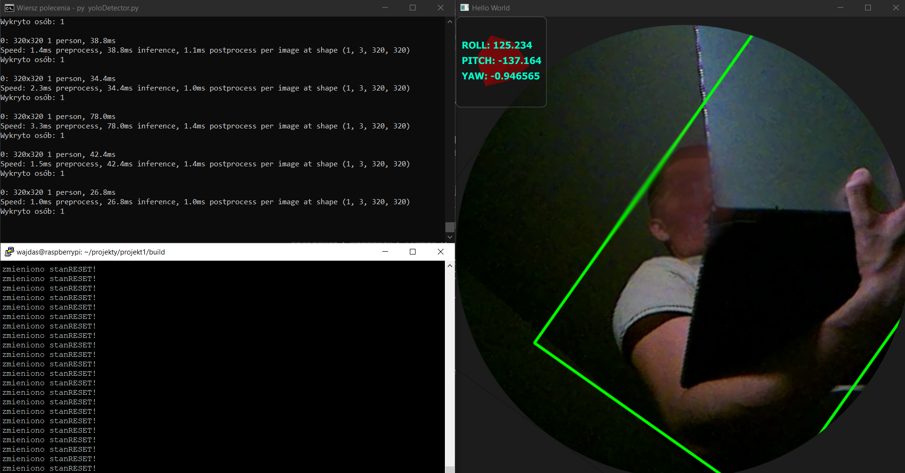
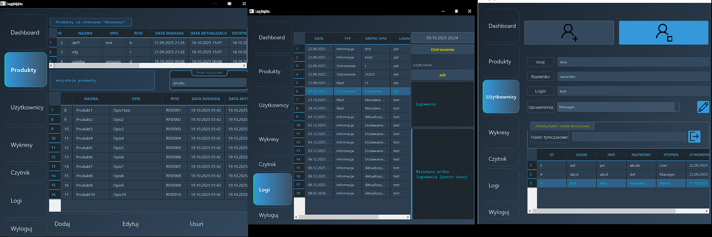
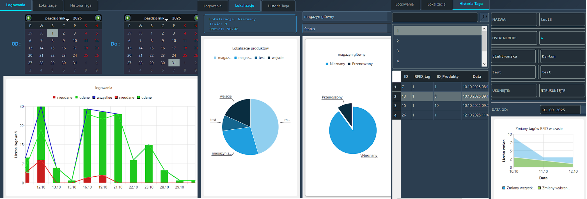
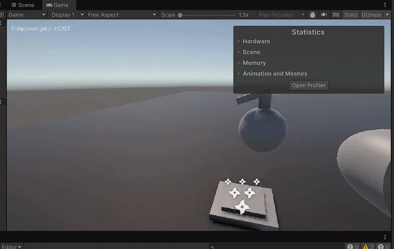

## Zapisane projekty

<h1>Ostatni Projekt</h1>

<h3>Inteligentna kamera obracająca obraz w osi ROLL względem Żyroskopu z wykrywaniem ludzi przez YOLOv8</h3>

<h3>System zarzadzania logistyką za pomocą RFID</h3>
Celem pracy było zaprojektowanie i implementacja systemu zarządzania logistyką z wykorzystaniem technologii RFID, usprawniającego kontrolę nad przepływem towarów i automatyzującego procesy magazynowe. Zakres obejmował analizę technologii RFID, opracowanie architektury systemu, implementację prototypu oraz jego testy funkcjonalne i wydajnościowe. Na podstawie wyników oceniono skuteczność rozwiązania oraz możliwości jego dalszego rozwoju i wdrożenia w logistyce.

<!--
**Wajdas1337/Wajdas1337** is a ✨ _special_ ✨ repository because its `README.md` (this file) appears on your GitHub profile.

<h3>Podstawowa obsługa gracza w Unity</h3>

  
  &nbsp;
  
  &nbsp;
  

